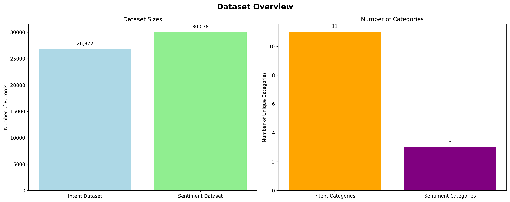
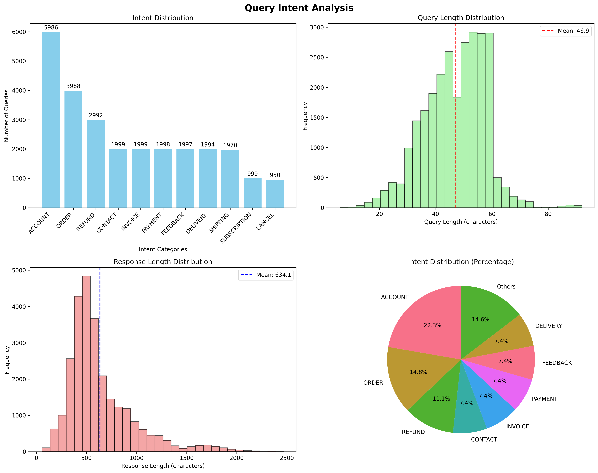
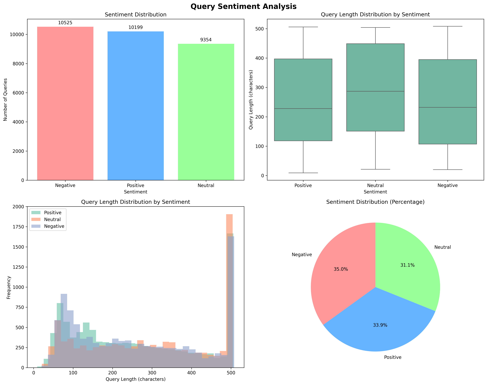

# Dataset Analysis

## Overview
Analysis of two main datasets focusing on query intent classification and sentiment analysis.

## Dataset Description

### Files
- `query_intent_response.csv`: Contains customer queries with their classified intents and corresponding responses
- `query_sentiment.csv`: Contains customer queries with their sentiment classifications

## Data Analysis Summary

### Query Intent Response Dataset
- **Total Records**: 26,872
- **Columns**: query, intent, response
- **Unique Intents**: 11

#### Intent Distribution
- **ACCOUNT**: 5,986 queries (22.3%)
- **ORDER**: 3,988 queries (14.8%)
- **REFUND**: 2,992 queries (11.1%)
- **CONTACT**: 1,999 queries (7.4%)
- **INVOICE**: 1,999 queries (7.4%)
- **PAYMENT**: 1,998 queries (7.4%)
- **FEEDBACK**: 1,997 queries (7.4%)
- **DELIVERY**: 1,994 queries (7.4%)
- **SHIPPING**: 1,970 queries (7.3%)
- **SUBSCRIPTION**: 999 queries (3.7%)
- **CANCEL**: 950 queries (3.5%)

#### Query Statistics
- **Average Query Length**: 46.9 characters
- **Shortest Query**: 6 characters
- **Longest Query**: 92 characters

#### Response Statistics
- **Average Response Length**: 634.1 characters
- **Shortest Response**: 57 characters
- **Longest Response**: 2472 characters

### Query Sentiment Dataset
- **Total Records**: 30,078
- **Columns**: query, sentiment
- **Unique Sentiments**: 3

#### Sentiment Distribution
- **Negative**: 10,525 queries (35.0%)
- **Positive**: 10,199 queries (33.9%)
- **Neutral**: 9,354 queries (31.1%)

#### Query Length by Sentiment
- **Negative**: 257.9 characters on average
- **Neutral**: 290.2 characters on average
- **Positive**: 256.8 characters on average

## Key Insights

### Intent Analysis
1. **Dominant Intent**: The most common intent is "ACCOUNT" with 5,986 queries
2. **Query Complexity**: Average query length is 46.9 characters, indicating moderate complexity
3. **Response Detail**: Responses are comprehensive with an average length of 634.1 characters

### Sentiment Analysis
1. **Sentiment Balance**: 10,199 positive vs 10,525 negative queries
2. **Query Length Patterns**: Different sentiments show varying query lengths, which could indicate different communication patterns
3. **Vocabulary Differences**: Each sentiment category has distinct commonly used words

## Usage
This data can be used for:
- Training intent classification models
- Sentiment analysis model development
- Customer service automation
- Understanding customer communication patterns
- Response generation systems

## Technical Details
- **Intent Dataset Size**: 26,872 records
- **Sentiment Dataset Size**: 30,078 records
- **File Format**: CSV with UTF-8 encoding
- **Analysis Date**: Generated automatically
